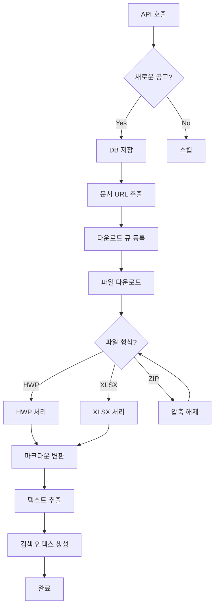

# 📐 Odin-AI 아키텍처 설계서

## 1. 시스템 개요

### 1.1 목적
- 나라장터 입찰공고 데이터의 체계적 수집, 처리, 저장, 검색
- 일일 475건+ 공고 처리 (월 14,000건+)
- HWP/PDF/XLSX 등 다양한 문서 형식 처리

### 1.2 핵심 요구사항
- 실시간 데이터 수집 (30분 주기)
- 중복 데이터 방지
- 빠른 검색 응답 (<2초)
- 문서 내용 전체 검색 가능

---

## 2. 데이터 수집 범위

### 2.1 API 수집 필드 (필수)
```yaml
기본정보:
  - bidNtceNo: 공고번호 (PK)
  - bidNtceOrd: 차수
  - bidNtceNm: 공고명
  - ntceInsttNm: 공고기관명
  - bidNtceDt: 공고일시

일정정보:
  - bidBeginDt: 입찰시작일시
  - bidClseDt: 입찰마감일시
  - opengDt: 개찰일시

금액정보:
  - presmptPrice: 추정가격
  - asignBdgtAmt: 배정예산

URL정보:
  - stdNtceDocUrl: 표준공고문서 URL (우선순위 1)
  - bidNtceDtlUrl: 상세페이지 URL
  - ntceSpecDocUrl1~10: 첨부파일 URL
  - ntceSpecFileNm1~10: 첨부파일명
```

### 2.2 다운로드 우선순위
```yaml
필수 다운로드:
  1. stdNtceDocUrl: 표준공고문서 (100% 다운로드)

선택적 다운로드:
  2. ntceSpecDocUrl1: 첨부파일1 (HWP 공고문인 경우)
  3. ntceSpecDocUrl2-3: 시방서/내역서 (XLSX/HWP)

조건부 다운로드:
  4. ZIP 파일: 압축 해제 후 내부 파일 처리
  5. 이미지 파일: 스킵 (JPG, PNG)
```

### 2.3 파일 처리 전략
```yaml
HWP (89%):
  - 1차: hwp5txt로 텍스트 추출
  - 2차: 실패시 pyhwp 사용
  - 3차: tools/hwp-viewer CLI

DOCX (5%):
  - python-docx로 직접 처리

XLSX/XLS (4%):
  - pandas로 데이터 추출
  - 주요 금액/항목 정보 추출

ZIP (1%):
  - 압축 해제
  - 내부 파일 재귀적 처리

PDF (1%):
  - PyPDF2 또는 pdfplumber
```

---

## 3. 데이터베이스 설계

### 3.1 테이블 구조

#### bid_announcements (공고 메인)
```sql
CREATE TABLE bid_announcements (
    -- 기본 키
    bid_notice_no VARCHAR(20) PRIMARY KEY,
    bid_notice_ord VARCHAR(3) DEFAULT '000',

    -- 공고 정보
    title VARCHAR(500) NOT NULL,
    organization_code VARCHAR(20),
    organization_name VARCHAR(200),
    department_name VARCHAR(200),

    -- 일정
    announcement_date TIMESTAMP,
    bid_start_date TIMESTAMP,
    bid_end_date TIMESTAMP,
    opening_date TIMESTAMP,

    -- 금액
    estimated_price BIGINT,
    assigned_budget BIGINT,

    -- 입찰 정보
    bid_method VARCHAR(50),
    contract_method VARCHAR(50),

    -- 담당자
    officer_name VARCHAR(100),
    officer_phone VARCHAR(50),
    officer_email VARCHAR(100),

    -- URL
    detail_page_url TEXT,
    standard_doc_url TEXT,

    -- 상태
    status VARCHAR(20) DEFAULT 'active',
    collection_status VARCHAR(20) DEFAULT 'pending',

    -- 메타데이터
    created_at TIMESTAMP DEFAULT CURRENT_TIMESTAMP,
    updated_at TIMESTAMP,
    collected_at TIMESTAMP,

    -- 인덱스
    INDEX idx_announcement_date (announcement_date),
    INDEX idx_organization (organization_code, organization_name),
    INDEX idx_status (status, collection_status),
    INDEX idx_dates (bid_start_date, bid_end_date)
);
```

#### bid_documents (문서 저장)
```sql
CREATE TABLE bid_documents (
    document_id SERIAL PRIMARY KEY,
    bid_notice_no VARCHAR(20) NOT NULL,

    -- 문서 정보
    document_type VARCHAR(20), -- 'standard', 'attachment1', 'attachment2', etc
    file_name VARCHAR(500),
    file_extension VARCHAR(10),
    file_size BIGINT,

    -- URL 정보
    download_url TEXT,
    file_seq INTEGER,

    -- 저장 정보
    storage_path TEXT,
    markdown_path TEXT,

    -- 처리 상태
    download_status VARCHAR(20) DEFAULT 'pending',
    processing_status VARCHAR(20) DEFAULT 'pending',

    -- 추출된 내용
    extracted_text TEXT,
    text_length INTEGER,
    extraction_method VARCHAR(50),

    -- 메타데이터
    downloaded_at TIMESTAMP,
    processed_at TIMESTAMP,
    error_message TEXT,

    FOREIGN KEY (bid_notice_no) REFERENCES bid_announcements(bid_notice_no),
    INDEX idx_bid_doc (bid_notice_no, document_type),
    INDEX idx_status (download_status, processing_status)
);
```

#### bid_search_index (검색 최적화)
```sql
CREATE TABLE bid_search_index (
    search_id SERIAL PRIMARY KEY,
    bid_notice_no VARCHAR(20) NOT NULL,

    -- 검색 필드
    search_title TEXT,
    search_organization TEXT,
    search_content TEXT,

    -- 전체 텍스트 검색
    search_vector TSVECTOR,

    -- 카테고리
    industry_category VARCHAR(100),
    region VARCHAR(100),

    -- 금액 범위 (검색용)
    price_range VARCHAR(20),

    FOREIGN KEY (bid_notice_no) REFERENCES bid_announcements(bid_notice_no),
    INDEX idx_search_vector USING GIN (search_vector),
    INDEX idx_category (industry_category, region)
);
```

#### bid_attachments (첨부파일 메타)
```sql
CREATE TABLE bid_attachments (
    attachment_id SERIAL PRIMARY KEY,
    bid_notice_no VARCHAR(20) NOT NULL,

    -- 첨부파일 정보
    attachment_index INTEGER, -- 1~10
    file_name VARCHAR(500),
    file_url TEXT,
    file_type VARCHAR(50),

    -- 분류
    document_category VARCHAR(50), -- '시방서', '내역서', '도면', etc

    -- 처리 여부
    should_download BOOLEAN DEFAULT FALSE,
    is_downloaded BOOLEAN DEFAULT FALSE,

    FOREIGN KEY (bid_notice_no) REFERENCES bid_announcements(bid_notice_no),
    INDEX idx_bid_attach (bid_notice_no, attachment_index)
);
```

#### bid_tags (해시태그 시스템)
```sql
CREATE TABLE bid_tags (
    tag_id SERIAL PRIMARY KEY,
    tag_name VARCHAR(100) UNIQUE NOT NULL,
    tag_category VARCHAR(50), -- 'industry', 'technology', 'region', 'requirement'

    -- 통계
    usage_count INTEGER DEFAULT 0,
    created_at TIMESTAMP DEFAULT CURRENT_TIMESTAMP,

    INDEX idx_tag_name (tag_name),
    INDEX idx_tag_category (tag_category)
);
```

#### bid_tag_relations (공고-태그 연결)
```sql
CREATE TABLE bid_tag_relations (
    relation_id SERIAL PRIMARY KEY,
    bid_notice_no VARCHAR(20) NOT NULL,
    tag_id INTEGER NOT NULL,

    -- 태그 메타데이터
    relevance_score FLOAT DEFAULT 1.0, -- 관련도 점수
    source VARCHAR(50), -- 'auto', 'manual', 'ai'
    created_at TIMESTAMP DEFAULT CURRENT_TIMESTAMP,

    FOREIGN KEY (bid_notice_no) REFERENCES bid_announcements(bid_notice_no),
    FOREIGN KEY (tag_id) REFERENCES bid_tags(tag_id),
    UNIQUE KEY unique_bid_tag (bid_notice_no, tag_id),
    INDEX idx_bid_tags (bid_notice_no),
    INDEX idx_tag_bids (tag_id)
);
```

### 3.2 데이터 관계도
```
bid_announcements (1) ─┬─ (N) bid_documents
                       ├─ (N) bid_attachments
                       ├─ (1) bid_search_index
                       └─ (N) bid_tag_relations ─── (N) bid_tags
```

### 3.3 해시태그 자동 생성 규칙

#### 산업 분야 태그
```yaml
건설/토목:
  키워드: ["건축", "토목", "시공", "공사", "건설"]
  태그: ["#건설", "#토목공사", "#건축공사"]

IT/소프트웨어:
  키워드: ["시스템", "소프트웨어", "SW", "개발", "구축"]
  태그: ["#IT", "#시스템구축", "#SW개발"]

의료/보건:
  키워드: ["병원", "의료", "보건", "약품", "의료기기"]
  태그: ["#의료", "#병원", "#의료기기"]

교육:
  키워드: ["학교", "교육", "대학", "초등", "중학", "고등"]
  태그: ["#교육", "#학교시설"]
```

#### 기술 요구사항 태그
```yaml
자격요건:
  - "#정보통신공사업"
  - "#전문건설업"
  - "#소프트웨어사업자"
  - "#ISO인증"

계약방법:
  - "#수의계약"
  - "#일반경쟁"
  - "#제한경쟁"
  - "#긴급입찰"
```

#### 지역 태그
```yaml
광역시도:
  - "#서울", "#경기", "#인천"
  - "#부산", "#대구", "#광주"
  - "#대전", "#울산", "#세종"
  - "#강원", "#충북", "#충남"
  - "#전북", "#전남", "#경북", "#경남"
  - "#제주"

세부지역:
  - 기관명/주소에서 자동 추출
  - 예: "강남구청" → "#서울 #강남구"
```

#### 금액 규모 태그
```yaml
규모별:
  - "#1억미만": < 100,000,000
  - "#1억-5억": 100,000,000 ~ 500,000,000
  - "#5억-10억": 500,000,000 ~ 1,000,000,000
  - "#10억-50억": 1,000,000,000 ~ 5,000,000,000
  - "#50억이상": > 5,000,000,000
```

#### 특수 태그
```yaml
긴급/우선:
  - "#긴급공고": 입찰기간 < 7일
  - "#재공고": reNtceYn = 'Y'
  - "#연간단가": 제목에 "연간단가" 포함
  - "#다년계약": 제목에 "다년" 포함

문서 유형:
  - "#도면포함": 첨부파일에 DWG/CAD
  - "#시방서포함": 첨부파일에 시방서
  - "#내역서포함": 첨부파일에 XLSX 내역서
```

---

## 4. 파일 시스템 구조

### 4.1 디렉토리 구조
```
data/
├── downloads/              # 원본 파일
│   ├── 2025/
│   │   ├── 09/
│   │   │   ├── 22/
│   │   │   │   ├── R25BK01066986/
│   │   │   │   │   ├── standard.hwp
│   │   │   │   │   ├── attachment_1.hwp
│   │   │   │   │   └── attachment_2.xlsx
│   │   │   │   └── R25BK01067953/
│   │   │   │       └── standard.hwp
│   │   │   └── 23/
│   │   └── 10/
│   └── temp/              # 임시 다운로드
│
├── processed/             # 처리된 파일
│   ├── markdown/
│   │   └── 2025/09/22/
│   │       ├── R25BK01066986/
│   │       │   ├── standard.md
│   │       │   └── summary.md
│   │       └── R25BK01067953/
│   │           └── standard.md
│   │
│   └── extracted/         # 추출된 데이터
│       └── 2025/09/22/
│           └── R25BK01066986/
│               ├── metadata.json
│               └── tables.csv
│
└── cache/                 # 캐시
    └── search_index/
```

### 4.2 파일 명명 규칙
```yaml
원본 파일:
  표준문서: standard.{ext}
  첨부파일: attachment_{index}.{ext}

처리된 파일:
  마크다운: {type}.md
  메타데이터: metadata.json

경로 패턴:
  {year}/{month}/{day}/{bid_notice_no}/{file}
```

---

## 5. 처리 파이프라인

### 5.1 데이터 수집 플로우


### 5.2 처리 우선순위
```python
처리_우선순위 = {
    1: "신규 공고 메타데이터 저장",
    2: "표준공고문서 다운로드",
    3: "표준문서 텍스트 추출",
    4: "해시태그 자동 생성",
    5: "검색 인덱스 생성",
    6: "첨부파일 선택적 다운로드",
    7: "첨부파일 처리"
}
```

### 5.3 해시태그 생성 파이프라인
```python
def generate_tags(announcement):
    tags = []

    # 1. 제목/내용 기반 태그
    title = announcement['title']
    tags.extend(extract_industry_tags(title))
    tags.extend(extract_requirement_tags(title))

    # 2. 지역 태그
    org_name = announcement['organization_name']
    tags.extend(extract_region_tags(org_name))

    # 3. 금액 태그
    if announcement['estimated_price']:
        tags.append(get_price_range_tag(announcement['estimated_price']))

    # 4. 계약 방법 태그
    if announcement['contract_method']:
        tags.append(f"#{announcement['contract_method']}")

    # 5. 문서 내용 기반 태그 (AI 분석)
    if announcement['extracted_text']:
        tags.extend(ai_extract_tags(announcement['extracted_text']))

    # 6. 중복 제거 및 정규화
    tags = list(set(normalize_tags(tags)))

    return tags
```

---

## 6. 성능 최적화

### 6.1 다운로드 최적화
```yaml
동시 다운로드:
  - 최대 5개 동시 다운로드
  - 파일당 타임아웃: 30초
  - 재시도: 3회

큐 시스템:
  - Redis 기반 작업 큐
  - 우선순위 큐 (표준문서 > 첨부파일)

캐싱:
  - 이미 다운로드한 파일 체크
  - MD5 해시로 중복 방지
```

### 6.2 검색 최적화
```yaml
인덱싱 전략:
  - PostgreSQL Full-text Search
  - tsvector + GIN 인덱스
  - 한글 형태소 분석기 적용
  - 해시태그 기반 빠른 필터링

캐싱:
  - Redis로 자주 검색되는 쿼리 캐싱
  - 인기 태그 조합 캐싱
  - 15분 TTL

응답 시간 목표:
  - 태그 검색: <0.2초
  - 단순 검색: <0.5초
  - 복합 검색: <1초
  - 전문 검색: <2초
```

### 6.3 해시태그 검색 최적화
```yaml
태그 검색:
  - 태그 AND/OR 조합 지원
  - 태그 자동완성 (Redis 캐싱)
  - 관련 태그 추천

예시 쿼리:
  "#건설 AND #서울 AND #10억이상"
  "#IT OR #SW개발"
  "#긴급공고 #수의계약"

태그 통계:
  - 인기 태그 Top 20 실시간 제공
  - 산업별 태그 분포
  - 지역별 태그 분포
```

---

## 7. 확장성 고려사항

### 7.1 스케일링 전략
```yaml
수평 확장:
  - 다운로더 워커 증설 (현재 1 → 최대 10)
  - 처리 워커 분리 (HWP, XLSX 전용)

수직 확장:
  - DB 읽기 전용 복제본
  - 검색 전용 ElasticSearch 추가 (선택)

스토리지:
  - S3 호환 스토리지 이전 가능
  - 3개월 이상 데이터 아카이빙
```

### 7.2 모니터링
```yaml
수집 지표:
  - 일일 수집량
  - 다운로드 성공률
  - 처리 성공률

성능 지표:
  - API 응답 시간
  - 다운로드 속도
  - 텍스트 추출 시간

알림:
  - 수집 실패 5회 이상
  - 다운로드 성공률 90% 미만
  - DB 용량 80% 초과
```

---

## 8. 보안 및 규정 준수

### 8.1 개인정보 처리
```yaml
마스킹 대상:
  - 담당자 전화번호 (뒤 4자리만 표시)
  - 담당자 이메일 (도메인만 표시)

로깅:
  - 개인정보 제외 로깅
  - 익명화된 ID 사용
```

### 8.2 크롤링 윤리
```yaml
요청 제한:
  - API: 초당 10회 이하
  - 다운로드: 동시 5개 이하
  - User-Agent: "Odin-AI/1.0"

robots.txt:
  - 준수 여부 확인
  - 제한 경로 회피
```

---

## 9. 구현 우선순위

### Phase 1 (1개월)
1. DB 스키마 구축 (태그 테이블 포함)
2. API 수집 모듈
3. 표준문서 다운로드
4. HWP 텍스트 추출
5. 해시태그 자동 생성
6. 기본 검색 기능 (태그 검색 포함)

### Phase 2 (1개월)
1. 첨부파일 처리
2. XLSX/ZIP 처리
3. 검색 고도화
4. 중복 처리 로직

### Phase 3 (1개월)
1. 성능 최적화
2. 모니터링 시스템
3. 알림 시스템
4. 관리자 대시보드

---

## 10. 기술 스택 정리

```yaml
Backend:
  - Python 3.11+
  - FastAPI
  - SQLAlchemy
  - Celery

Database:
  - PostgreSQL 15+
  - Redis 7+

문서 처리:
  - hwp5txt
  - pyhwp
  - python-docx
  - pandas
  - PyPDF2

다운로드:
  - aiohttp
  - curl (백업)
  - Selenium (필요시)

검색:
  - PostgreSQL FTS
  - (선택) ElasticSearch

모니터링:
  - Prometheus
  - Grafana
  - Sentry
```

---

이 아키텍처는 일일 475건, 월 14,000건의 공고를 안정적으로 처리할 수 있도록 설계되었습니다.