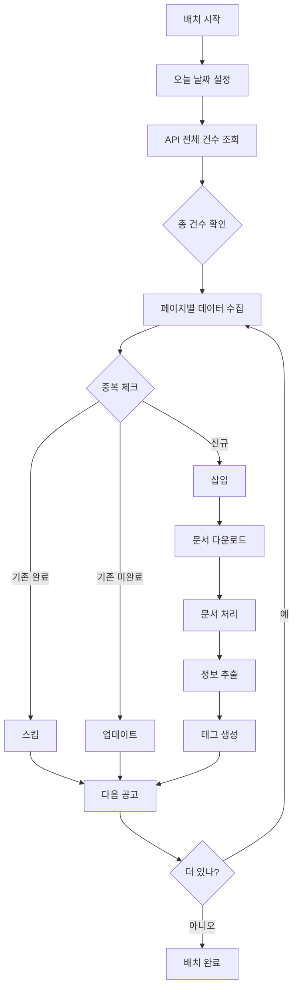

# 📋 배치 프로그램 프로덕션 요구사항
**작성일**: 2025-09-23
**상태**: 내일 작업 예정

## ⚠️ 중요 수정사항

### 1. ❌ 초기화 코드 제거
**문제점**: 현재 테스트 코드에 DB 초기화 및 파일 삭제 로직이 포함되어 있음

**수정 필요**:
```python
# 제거해야 할 코드들:
- reset_database()  # DB 테이블 DROP
- reset_storage()   # 파일 시스템 삭제
- DROP TABLE 관련 모든 코드
- shutil.rmtree() 관련 코드
```

**이유**: 프로덕션에서는 기존 데이터를 보존해야 함

---

### 2. 📅 API 호출 기간 수정
**현재 문제**: 일주일 단위로 조회 (202509160000 ~ 202509232359)

**수정 방향**:
```python
# 변경 전
start_date = '202509160000'  # 일주일 전
end_date = today.strftime('%Y%m%d2359')

# 변경 후 (하루 단위)
today = datetime.now()
start_date = today.strftime('%Y%m%d0000')
end_date = today.strftime('%Y%m%d2359')
```

**이유**: 일일 배치는 당일 데이터만 수집해야 함

---

### 3. 📊 전체 데이터 건수 확인
**현재 문제**: numOfRows=10으로 고정되어 있어 전체 건수 파악 불가

**수정 방향**:
```python
# 1단계: 전체 건수 확인
url = f"...&numOfRows=1&pageNo=1..."
response = requests.get(url)
total_count = data['response']['body']['totalCount']
print(f"오늘 총 공고 수: {total_count}개")

# 2단계: 페이지네이션으로 전체 수집
page_size = 100
total_pages = (total_count + page_size - 1) // page_size

for page in range(1, total_pages + 1):
    url = f"...&numOfRows={page_size}&pageNo={page}..."
    # 데이터 수집
```

---

### 4. 🔄 중복 처리 로직
**현재 문제**: 중복 체크 없이 무조건 insert/update

**수정 방향**:
```python
def process_announcement(item):
    # 1. 기존 데이터 확인
    existing = session.query(BidAnnouncement).filter_by(
        bid_notice_no=item['bidNtceNo']
    ).first()

    if existing:
        # 2. 이미 처리 완료된 경우 스킵
        if existing.collection_status == 'completed':
            logger.info(f"스킵: {item['bidNtceNo']} (이미 처리됨)")
            return 'skipped'

        # 3. 미완료 데이터는 업데이트
        else:
            existing.updated_at = datetime.now()
            # 필요한 필드만 업데이트
            return 'updated'

    else:
        # 4. 신규 데이터 삽입
        new_announcement = BidAnnouncement(...)
        session.add(new_announcement)
        return 'inserted'
```

---

## 📝 프로덕션 배치 플로우



---

## 🚀 내일 작업 계획

### Phase 1: 코드 정리
1. [ ] 테스트용 초기화 코드 제거
2. [ ] 프로덕션용 배치 스크립트 생성
3. [ ] 로깅 시스템 개선

### Phase 2: API 수집 개선
1. [ ] 당일 데이터만 조회하도록 수정
2. [ ] 전체 건수 확인 로직 추가
3. [ ] 페이지네이션 구현

### Phase 3: 중복 처리
1. [ ] 공고별 중복 체크 로직
2. [ ] 처리 상태별 분기 처리
3. [ ] 통계 정보 수집

### Phase 4: 성능 최적화
1. [ ] 배치 처리 (bulk insert)
2. [ ] 트랜잭션 관리
3. [ ] 에러 핸들링

---

## 📌 참고사항

- **현재 작동하는 코드**: `testing/batch_scripts/complete_pipeline_v3.py`
- **테스트 DB**: `odin_db`
- **API Key**: 환경변수로 관리 필요
- **실행 주기**: 일일 1회 (새벽 권장)

---

## ⚡ 예상 이슈 및 대응

1. **API 제한**:
   - 한 번에 최대 999개까지 조회 가능
   - 페이지네이션으로 해결

2. **중복 데이터**:
   - 공고 수정/재공고 시 업데이트 필요
   - updated_at 필드로 추적

3. **대용량 처리**:
   - 하루 500건 이상 시 배치 분할
   - 비동기 처리 고려

---

**내일 작업 시작 시간**: 오전 예정
**예상 소요 시간**: 2-3시간