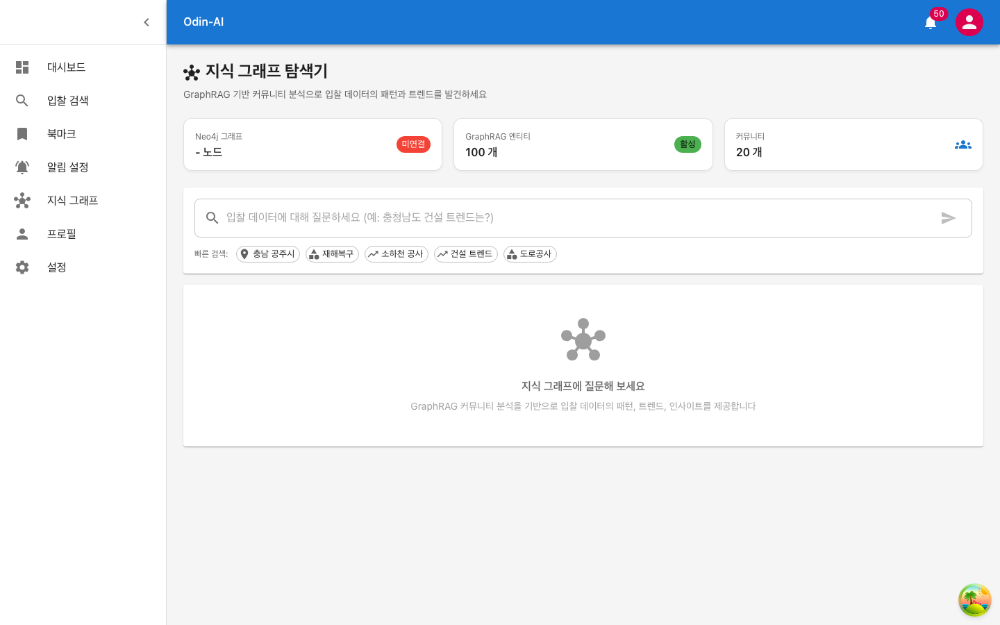

<!-- _class: lead -->
<!-- _backgroundColor: #1565C0 -->
<!-- _color: #fff -->

# ODIN-AI

### 공공입찰 정보 AI 분석 플랫폼

나라장터 입찰공고를 AI가 자동으로 수집하고
**의미 검색 · 관계 분석 · 트렌드 예측**을 수행합니다

**완전 로컬 AI · 월 비용 $0 · 데이터 프라이버시 100%**

---

# 목차

| 파트 | 내용 |
|------|------|
| **Part 1** | 제품 소개 — 문제 정의, 솔루션, 핵심 성과 |
| **Part 2** | 주요 기능 — 실제 화면 기반 시연 |
| **Part 2.5** | 관리자 대시보드 — 운영 관리 시스템 |
| **Part 3** | 핵심 기술 Deep Dive — RAG, GraphRAG, 온톨로지 |
| **Part 4** | 기술 스펙 — 아키텍처, 모델, 파이프라인 |
| **Part 5** | 사업성 — 비용, 스토리지, 로드맵 |

---

<!-- _class: lead -->
<!-- _backgroundColor: #E3F2FD -->

# Part 1

## 제품 소개

---

# 문제 정의

### 공공입찰 시장, 지금 이렇게 작동합니다

| 현재 문제 | 비즈니스 영향 |
|----------|-------------|
| 하루 평균 **1,231건** 신규 공고 발생 | 수작업 확인 물리적 불가능 |
| 키워드 일치 검색만 가능 | "도로 정비" 검색 시 "도로복구" 누락 |
| 공고 간 연관관계 파악 불가 | 같은 기관의 유사 공고를 놓침 |
| 트렌드/패턴 분석 도구 부재 | 어떤 지역에 어떤 공사가 집중되는지 파악 불가 |

> 중소기업 영업팀이 매일 **2~3시간**을 공고 탐색에 소비하고 있습니다.

---

# ODIN-AI 솔루션

| 구분 | 기존 (나라장터 수동 검색) | ODIN-AI |
|------|----------------------|---------|
| 검색 | 키워드 일치 | **AI 의미 검색** (벡터 유사도) |
| 결과 | 1건씩 열어서 확인 | 관련 공고 **자동 그룹핑** |
| 분석 | 직접 엑셀 정리 | 지역/기관/태그 **네트워크 분석** |
| 트렌드 | 감에 의존 | AI **커뮤니티 기반 트렌드 리포트** |
| 알림 | 매일 직접 접속 | **맞춤형 알림** 자동 발송 |
| Q&A | 해당 없음 | "경기도 건설 입찰 조건?" → **법률 근거 포함 답변** |

---

# 핵심 성과

| 지표 | 수치 | 의미 |
|------|------|------|
| 입찰공고 수집 | **18,977건** | 2주간 4개 카테고리 실데이터 |
| 등록 사용자 | **112명** | 베타 테스트 중 확보 |
| 벡터 임베딩 청크 | **7,056개** | 문서 내용 의미 검색 가능 |
| 그래프 노드 | **767개** | 기관·태그·지역 관계 네트워크 |
| 그래프 관계 | **42,183개** | 유사 공고 자동 연결 |
| GraphRAG 커뮤니티 | **20개** | 자동 트렌드 감지 |
| 테스트 통과 | **59/59** (100%) | E2E 전 기능 검증 완료 |
| 월 AI 비용 | **$0** | 완전 로컬 실행 |

---

<!-- _class: lead -->
<!-- _backgroundColor: #E8F5E9 -->

# Part 2

## 주요 기능 — 실제 화면

---

# 로그인 / 회원가입


JWT 기반 보안 인증 시스템. 이메일과 비밀번호로 로그인하며,
회원가입 시 이메일 인증을 거쳐 계정을 활성화합니다.

---

# 대시보드


실시간 입찰 현황을 한눈에 파악합니다.
**통계 카드**: 오늘의 신규 입찰, 마감 임박, 북마크, AI 매칭 건수를 요약 표시

---

# AI 입찰 검색


"건설공사" 검색 시 **1,122건** 관련 공고를 즉시 반환합니다.
**벡터 유사도 기반** 의미 검색으로 키워드가 정확히 일치하지 않아도 관련 공고를 모두 찾아줍니다.

---

# 입찰 상세 정보


포항시 건축공사 사례 — 예정가격 **6.26억원**, 발주기관, 공고일, 마감일,
자격요건, RFP 문서 분석 결과를 한 화면에서 확인합니다.

---

# 알림 수신함


관심 조건에 매칭된 입찰공고 알림을 **50건** 수신한 화면입니다.
키워드, 가격 범위, 지역 기반으로 자동 매칭하여 이메일과 인앱 알림을 발송합니다.

---

# 알림 설정


사용자가 직접 알림 규칙을 설정합니다.
**키워드 매칭**, **가격 범위 필터**, **지역 제한**, **이메일/푸시 알림 토글** 기능 제공

---

# 북마크 관리


관심 입찰공고를 북마크하여 관리합니다.
검색 결과에서 원클릭 북마크 추가/삭제, 북마크 목록에서 상세 정보 바로 확인 가능

---

# 지식 그래프 탐색기



GraphRAG 엔티티 **100개**, 커뮤니티 **20개** 실시간 표시
빠른 검색: 충남 공주시, 재해복구, 소하천 공사, 건설 트렌드, 도로공사

---

# AI 트렌드 분석 결과


"충청남도 건설 트렌드" → AI가 **5개 커뮤니티 데이터를 종합 분석**하여 리포트 자동 생성
우측에 관련 커뮤니티 카드 (#6, #7, #10, #14, #2)와 태그 표시

---

# 구독 관리


3단계 요금제 비교: **베이직(무료)**, **프로(29,000원/월)**, **엔터프라이즈(99,000원/월)**
사용량 모니터링과 결제 내역 관리를 제공합니다.

---

# AI 분석 상세 — 실제 답변 예시

**질의**: "경기도 건설 입찰 조건은?"

> **1. 법률 준수**: 「지방자치단체를 당사자로 하는 계약에 관한 법률 시행령」 제13조 자격 요건 충족 필수
> **2. 업종 등록**: 전문소방시설공사업(0040), 실내건축공사업 등 해당 업종 등록 필요
> **3. 소재지 요건**: 법인등기부상 본점 소재지가 경기도 내 위치
> **4. 전자조달 등록**: 국가종합전자조달시스템(GPIS) 참가자격 등록
> **5. 부정당업자 제한**: 참가자격 제한 중이 아닌 업체

근거 문서 3건을 자동 인용하며, 법률 조항까지 구체적으로 답변합니다.

---

<!-- _class: lead -->
<!-- _backgroundColor: #FFF8E1 -->

# Part 2.5

## 관리자 대시보드

---

# 관리자 대시보드


시스템 전체 현황을 실시간으로 모니터링합니다.
**입찰공고 18,977건**, **등록 사용자 112명**, 배치 실행 상태, 시스템 메트릭을 한눈에 확인

---

# 배치 모니터링


하루 3회(07:00, 12:00, 18:00) 자동 배치 실행 현황을 관리합니다.
수동 배치 실행, 날짜 범위 선택, 알림 발송 ON/OFF 토글 기능 제공

---

# 알림 모니터링


알림 발송 현황을 실시간으로 추적합니다.
사용자별 알림 수, 이메일 발송 성공/실패율, 알림 규칙 **3개** 관리 상태를 확인합니다.

---

# 사용자 관리


**112명** 등록 사용자의 상세 정보를 관리합니다.
구독 플랜별 필터링, 활성/비활성 토글, 사용자별 활동 통계 및 알림 규칙 확인 가능

---

<!-- _class: lead -->
<!-- _backgroundColor: #FFF3E0 -->

# Part 3

## 핵심 기술 Deep Dive

---

# 기술 노하우 1 — RAG (Retrieval-Augmented Generation)

### 왜 RAG인가

일반적인 LLM은 학습 데이터에 없는 **최신 입찰공고에 대해 답변할 수 없습니다.**
RAG는 이 한계를 극복합니다.

```
┌─────────────┐    ┌──────────────┐    ┌─────────────┐
│  사용자 질문  │───▶│ 관련 문서 검색 │───▶│ LLM 답변 생성 │
│              │    │  (벡터 DB)   │    │ (문서 기반)   │
└─────────────┘    └──────────────┘    └─────────────┘
```

- LLM이 **할루시네이션** 없이 실제 문서를 근거로 답변
- 새 공고가 추가되면 **재학습 없이** 즉시 검색 가능
- 출처(문서 번호, 섹션)를 함께 제공하여 **신뢰성 확보**

---

# RAG 기술 상세 — 하이브리드 검색

### 두 가지 검색을 결합하여 정확도를 극대화합니다

| 검색 방식 | 기술 | 장점 | 약점 |
|----------|------|------|------|
| **벡터 유사도** | KURE-v1 + pgvector cosine | 의미가 비슷한 문서를 찾음 | 정확한 고유명사에 약함 |
| **키워드 매칭** | PostgreSQL pg_trgm | 정확한 단어 매칭 | 동의어/유의어 놓침 |
| **하이브리드 (RRF)** | Reciprocal Rank Fusion | **두 방식의 장점 결합** | — |

### RRF 공식

```
RRF_score(d) = Σ  1 / (k + rank_i(d))
```

k=60으로 설정, 벡터 검색 순위와 키워드 검색 순위를 역수 합산하여 최종 랭킹 결정

---

# RAG 기술 상세 — 한국어 특화 임베딩

### KURE-v1을 선택한 이유

| 항목 | KURE-v1 | OpenAI text-embedding-3-small |
|------|---------|-------------------------------|
| 개발사 | KAIST NLP Lab | OpenAI |
| 벤치마크 | MTEB 한국어 검색 **1위** | 범용 (한국어 최적화 아님) |
| 차원 | 1024 | 1536 |
| 비용 | **$0** (로컬) | $0.02 / 1M토큰 |
| 프라이버시 | **100% 로컬** | 외부 API 전송 |
| 한국어 법률 용어 | 학습 데이터에 포함 | 제한적 |

- 입찰 문서에는 "하도급", "전자조달", "예정가격" 등 **한국어 법률/행정 용어**가 빈번
- 한국어 특화 모델이 범용 영어 모델 대비 **검색 정확도 현저히 우수**

---

# RAG 기술 상세 — LLM 답변 합성

### EXAONE 3.5 (7.8B) — LG AI Research

| 항목 | EXAONE 3.5 | Llama 3.1 8B | GPT-4 Turbo |
|------|-----------|-------------|-------------|
| KoMT-Bench | **7.96** | 4.85 | 8.5+ |
| 파라미터 | 7.8B | 8B | ~1.7T (추정) |
| 실행 환경 | **Ollama 로컬** | Ollama 로컬 | 클라우드 API |
| 비용 | **$0** | $0 | $30/1M토큰 |
| 프라이버시 | **100% 로컬** | 100% 로컬 | 외부 전송 |

- KoMT-Bench에서 **동급 모델 중 한국어 생성 품질 1위**
- 법률 조항 인용, 행정 용어 해석을 정확하게 수행
- Ollama로 로컬 실행하여 **네트워크 지연 없이** 5~10초 내 답변 생성

---

# 기술 노하우 2 — GraphRAG (그래프 기반 RAG)

### RAG의 한계와 GraphRAG의 해결

| 문제 | RAG | GraphRAG |
|------|-----|----------|
| "도로공사 조건은?" | 답변 가능 (개별 문서 검색) | 답변 가능 |
| "충청남도 건설 **트렌드**는?" | **답변 불가** (글로벌 패턴 파악 불가) | **답변 가능** |
| "어떤 지역에 재해복구가 집중?" | 답변 불가 | **커뮤니티 분석으로 답변** |

> RAG는 **개별 문서** 수준의 질문에 강하지만,
> **전체 데이터셋의 패턴과 트렌드**를 파악하는 질문에는 한계가 있습니다.
> GraphRAG가 이 갭을 메웁니다.

---

# GraphRAG 기술 상세 — LazyGraphRAG 파이프라인

### 4단계 인덱싱 프로세스

```
Step 1. 엔티티 추출 (EXAONE 3.5)
        입찰문서 → [프로젝트, 기관, 지역, 규정, 자재, 기술] 추출
                                    ↓
Step 2. 관계 그래프 구축
        엔티티 간 co-occurrence 기반 관계 생성
                                    ↓
Step 3. 커뮤니티 감지 (Louvain 알고리즘)
        밀접하게 연결된 엔티티들을 자동 그룹핑
                                    ↓
Step 4. 커뮤니티 요약 (EXAONE 3.5)
        각 커뮤니티의 제목, 요약, 주요 발견 자동 생성
```

- Microsoft Research의 GraphRAG 논문 기반
- **LazyGraphRAG**: 기존 Neo4j 그래프를 재활용하여 비용 최소화

---

# GraphRAG 기술 상세 — 커뮤니티 분석 원리

### Louvain 알고리즘으로 자동 그룹핑

**입력**: 100개 엔티티 + 엔티티 간 관계 그래프

**출력**: 20개 커뮤니티 (의미적으로 연관된 엔티티 집합)

| 커뮤니티 ID | 제목 | 엔티티 수 | 입찰 건수 |
|------------|------|----------|----------|
| #6 | 우성면 소하천 재해복구사업 | 3 | 1 |
| #7 | 우성면 소하천(은골천,중새터천) 재해복구 | 3 | 1 |
| #10 | 유구읍 명곡리 오골천 소하천 재해복구 | 3 | 1 |
| #14 | 보령시 수산업 경영인연합회관 개보수 | 3 | 1 |
| #2 | 공주시 금학동 회선동천 소하천 재해복구 | 3 | 1 |

> 글로벌 질의 시, 관련 커뮤니티 요약을 종합하여 **트렌드 리포트를 자동 생성**합니다.

---

# GraphRAG — 실제 분석 사례

### 질의: "충청남도 건설 트렌드"

**AI가 5개 커뮤니티를 종합 분석한 결과:**

| 트렌드 | 분석 내용 |
|--------|----------|
| **재해복구 집중** | 소하천 및 하천 관련 공사가 활발, 기후 변화 대응 투자 증가 |
| **규정 준수 강화** | 모든 프로젝트에서 입찰공고 규정 준수가 핵심 요소로 부각 |
| **지역별 다양성** | 우성면·유구읍·보령시·공주시 각 지역 특성에 맞는 프로젝트 진행 |
| **자재 조달 중요** | 재해복구·개보수 공사에서 자재 조달 계획이 성패 요인 |

> 이 분석은 기존 키워드 검색으로는 **절대 불가능한** 인사이트입니다.

---

# 기술 노하우 3 — 온톨로지 기반 지식 구조

### 입찰공고 도메인 지식 체계화

```
공공입찰 (Public Bidding)
├── 공사 (Construction)
│   ├── 건축공사 → 신축 / 증축 / 리모델링
│   ├── 토목공사 → 도로 / 교량 / 터널 / 하천
│   ├── 전기공사 / 통신공사 / 소방공사
│   └── 조경공사
├── 용역 (Service)
│   ├── 시스템개발 → 웹 / 앱 / AI
│   ├── 컨설팅 / 연구 / 유지보수
│   └── 설계 / 감리
├── 물품 (Goods)
│   └── 사무용품 / 장비 / 자재
└── 외자 (Foreign Purchase)
```

---

# 온톨로지 — 왜 필요한가

### 검색 확장과 자동 분류의 핵심

| 문제 | 키워드 검색 | 온톨로지 기반 |
|------|-----------|-------------|
| "도로공사" 검색 | "도로공사"만 검색됨 | **교량, 터널, 포장** 자동 포함 |
| 카테고리 분류 | 수동 / 규칙 기반 | **계층 구조로 자동 분류** |
| 유사 업종 매칭 | 정확히 같은 키워드만 | **상위 개념으로 확장** 검색 |

### ODIN-AI의 온톨로지 적용

- **Neo4j Tag 노드** (10종): 건설, 물품, 토목, 전기, 소프트웨어, 용역, 긴급, 통신 등
- **GraphRAG 엔티티 유형** (6종): Project, Organization, Region, Regulation, Material, Technology
- **계층적 관계**: IS_A (하위 개념), RELATED_TO (연관 개념)

> 향후 50개 → 200개 → 500개로 온톨로지 확장 계획

---

# 온톨로지 — 자동 태깅 파이프라인

### 입찰공고 → 자동 분류 → 온톨로지 매핑

```
입찰공고 제목: "2025년 우성면 소하천 재해복구사업"
                    ↓
Step 1. 키워드 추출:  [소하천, 재해복구, 우성면]
                    ↓
Step 2. 온톨로지 매핑: 소하천 → 하천 → 토목공사 → 공사
                      재해복구 → 재해 → 긴급
                    ↓
Step 3. 태그 자동 생성: #토목 #건설 #긴급
                    ↓
Step 4. Neo4j 관계:   TAGGED_WITH → [토목, 건설, 긴급]
                      IN_REGION → [충청남도]
                      CLASSIFIED_AS → [토목공사]
```

- 분류 정확도 현재 **80%** → LLM 기반 자동 확장으로 **95% 목표**

---

<!-- _class: lead -->
<!-- _backgroundColor: #F3E5F5 -->

# Part 4

## 기술 스펙

---

# 시스템 아키텍처

```
                     ┌─────────────────────────────┐
                     │    Frontend (React 18 + TS)  │
                     │    Material-UI · GraphExplorer│
                     └──────────┬──────────────────┘
                                │ REST API
                     ┌──────────▼──────────────────┐
                     │     FastAPI Backend          │
                     │  rag_search · graph_search   │
                     └──┬──────────┬───────────┬───┘
                        │          │           │
              ┌─────────▼──┐  ┌───▼────┐  ┌───▼──────┐
              │ PostgreSQL  │  │ Neo4j  │  │ Ollama   │
              │ + pgvector  │  │ 5.15   │  │ (Local)  │
              │             │  │        │  │          │
              │ 7,056 청크  │  │ 767    │  │ EXAONE   │
              │ vector(1024)│  │ nodes  │  │ 3.5 7.8B │
              │ graphrag_*  │  │ 42K    │  │ KURE-v1  │
              └─────────────┘  │ rels   │  └──────────┘
                               └────────┘
```

---

# AI 모델 스펙

| 역할 | 모델 | 파라미터 | 벤치마크 | RAM |
|------|------|---------|---------|-----|
| 임베딩 | **KURE-v1** (KAIST NLP) | 560M | MTEB 한국어 검색 **1위** | 2.4GB |
| LLM | **EXAONE 3.5** (LG AI Research) | 7.8B | KoMT-Bench **7.96** | 6~8GB |
| 벡터 차원 | 1024 | — | OpenAI 1536 대비 33% 절감 | — |
| 벡터 인덱스 | HNSW (pgvector) | — | ANN 검색 최적화 | — |

### 핵심 선택 기준

- **한국어 특화**: 입찰 문서의 법률/행정 용어 이해도
- **완전 로컬**: 데이터 유출 제로, API 비용 제로
- **실시간 응답**: 검색 3초, Q&A 10초 이내

---

# 데이터 파이프라인

| 단계 | 처리 | 기술 | 산출물 |
|------|------|------|--------|
| 1. 수집 | 나라장터 API | 공공데이터포털 REST | **18,977건** 메타데이터 |
| 2. 다운로드 | HWP/PDF 저장 | aiohttp 비동기 | 원본 문서 파일 |
| 3. 변환 | 마크다운 변환 | hwp5txt, PyPDF2 | 텍스트 데이터 |
| 4. 청킹 | 512토큰 분할 | 섹션별 분리 | 7,056개 청크 |
| 5. 임베딩 | 벡터 생성 | KURE-v1 (1024dim) | pgvector 저장 |
| 6. 그래프 | PG → Neo4j 동기화 | neo4j driver | 767노드 42K관계 |
| 7. 엔티티 | 개체명 인식 | EXAONE 3.5 | 100개 엔티티 |
| 8. 커뮤니티 | 그룹핑 | Louvain | 20개 커뮤니티 |

**배치 스케줄**: 하루 3회 (07:00, 12:00, 18:00) 자동 실행

---

# API 엔드포인트

| 엔드포인트 | 기능 | 응답 시간 |
|-----------|------|----------|
| `GET /api/rag/status` | RAG 시스템 상태 조회 | < 1초 |
| `GET /api/rag/search?q=` | 하이브리드 의미 검색 | < 3초 |
| `GET /api/rag/ask?q=` | LLM 기반 질의응답 | < 10초 |
| `GET /api/rag/global-ask?q=` | GraphRAG 글로벌 트렌드 분석 | < 15초 |
| `GET /api/graph/status` | Neo4j 그래프 상태 | < 1초 |
| `GET /api/graph/tag/{tag}` | 태그별 네트워크 조회 | < 2초 |
| `GET /api/graph/region/{region}` | 지역별 입찰 목록 | < 2초 |
| `POST /api/auth/login` | JWT 인증 로그인 | < 1초 |
| `CRUD /api/notifications/rules` | 알림 규칙 관리 | < 1초 |

---

# 보안 스펙

| 항목 | 구현 방식 |
|------|----------|
| 인증 | JWT Bearer Token (HS256, 30분 만료) |
| 비밀번호 | bcrypt 해시 (72바이트 제한 처리) |
| XSS 방어 | HTML sanitization 적용 |
| SQL Injection | Parameterized queries 전면 사용 |
| Rate Limiting | 엔드포인트별 호출 제한 |
| CORS | 허용 도메인 화이트리스트 |
| **데이터 프라이버시** | **100% 온프레미스** — 외부 API 전송 없음 |

> 공공입찰 문서를 외부 LLM(GPT-4 등)에 전송하지 않으므로
> **데이터 유출 위험이 원천적으로 차단**됩니다.

---

<!-- _class: lead -->
<!-- _backgroundColor: #E8F5E9 -->

# Part 5

## 사업성

---

# 비용 비교

| 항목 | ODIN-AI (로컬) | OpenAI 기반 (클라우드) |
|------|---------------|----------------------|
| 임베딩 | **$0** (KURE-v1) | ~$15/월 |
| LLM Q&A | **$0** (EXAONE 3.5) | ~$150+/월 (GPT-4) |
| 벡터 DB | **$0** (pgvector) | ~$70/월 (Pinecone) |
| 그래프 DB | **$0** (Neo4j CE) | ~$65+/월 (Aura) |
| **월 합계** | **$0** | **$300+** |
| **연간 합계** | **$0** | **$3,600+** |

> 동일 기능 대비 **연간 $3,600+ 절감**
> 프라이버시 100% 보장 + 무제한 호출 + 네트워크 지연 없음

---

# 구독 요금제 — 비즈니스 모델

| 플랜 | 월 요금 | 주요 기능 |
|------|--------|----------|
| **베이직** | 무료 | 기본 검색, 북마크 10건, 알림 3건 |
| **프로** | 29,000원 | AI 의미 검색, 무제한 북마크, 알림 50건, 그래프 탐색 |
| **엔터프라이즈** | 99,000원 | 전체 기능, API 접근, 맞춤 리포트, 전담 지원 |

현재 **112명** 등록 사용자 중 베타 테스트 진행 중
유료 전환 목표: 프로 플랜 기준 **월 100명 = 290만원 MRR**

---

# 스토리지 추정

### 입찰공고 1건당 저장 용량

| 구성요소 | 건당 크기 |
|---------|----------|
| 원본 문서 (HWP/PDF) | ~50KB |
| 마크다운 + 메타데이터 | ~23KB |
| RAG 벡터 임베딩 (1024dim) | ~60KB |
| Neo4j 노드/관계 | ~10KB |
| GraphRAG 엔티티 | ~10KB |
| **합계** | **~253KB** |

### 성장 예측 (전체 카테고리 수집 시, 일 1,231건)

| 기간 | 예상 용량 | 비고 |
|------|----------|------|
| **1년** | **89GB** | 서버 SSD 1개로 충분 |
| 3년 | 268GB | 일반 서버 수준 |
| 5년 | 447GB | 스토리지 확장 필요 |

---

# QA 테스트 결과

| 카테고리 | 테스트 수 | 결과 | 주요 검증 항목 |
|---------|----------|------|---------------|
| RAG 시스템 | 12 | **12 PASS** | 임베딩, 벡터 검색, 하이브리드 검색, LLM Q&A |
| Neo4j 그래프 | 10 | **10 PASS** | 연결 상태, 노드/관계, 태그/지역 검색 |
| GraphRAG | 12 | **12 PASS** | 엔티티, 커뮤니티, 글로벌 Q&A |
| 프론트엔드 | 7 | **7 PASS** | 페이지 렌더링, 상태 카드, 검색 |
| 통합 테스트 | 8 | **8 PASS** | RAG+Graph 연동, E2E, API 형식 |
| E2E (Playwright) | 59 | **59 PASS** | 관리자 14건, 사용자 28건, 인증 10건, API 7건 |
| **합계** | **108** | **108 PASS** | **성공률 100%** |

---

# 향후 로드맵

| 시기 | 계획 | 기대 효과 |
|------|------|----------|
| **1개월** | 전체 카테고리 수집 (공사+용역+물품+외자) | 데이터 **5배** 확대 (일 1,231건) |
| | 임베딩 커버리지 84% → 95% | 검색 정확도 향상 |
| **3개월** | Neo4j 실시간 시각화 (D3.js/Cytoscape) | 관계 탐색 UX 개선 |
| | 알림 고도화 + 모바일 반응형 | 사용자 접근성 확대 |
| | 온톨로지 200개 개념으로 확장 | 자동 분류 정확도 95% |
| **6개월** | **입찰 성공률 예측 AI** | 의사결정 지원 |
| | **자동 제안서 초안 생성** | 업무 시간 70% 단축 |
| | 멀티홉 추론 (A→B→C 관계 탐색) | 연관 공고 추천 강화 |

---

# 기술 차별점 요약

| 구분 | ODIN-AI | 기존 입찰 검색 서비스 |
|------|---------|------------------|
| AI 모델 | 한국어 특화 (KURE-v1 + EXAONE) | 키워드 매칭 또는 영어 모델 |
| 비용 | **$0/월** | $300+/월 |
| 검색 | 벡터 + 키워드 하이브리드 (RRF) | 키워드 일치만 |
| 분석 | RAG Q&A + GraphRAG 트렌드 | 단순 필터링 |
| 관계 분석 | Neo4j 지식 그래프 (42K 관계) | 없음 |
| 프라이버시 | **100% 온프레미스** | 외부 API 전송 |
| 온톨로지 | 도메인 특화 계층 분류 | 수동 카테고리 |
| 테스트 | 108/108 PASS (100%) | 미공개 |

---

<!-- _class: lead -->
<!-- _backgroundColor: #1565C0 -->
<!-- _color: #fff -->

# ODIN-AI

### 공공입찰의 새로운 패러다임

나라장터 입찰공고를 AI가 자동으로 수집, 분석, 추천합니다

**18,977건 실데이터 · 112명 사용자 · 완전 로컬 AI · 월 비용 $0**

감사합니다
