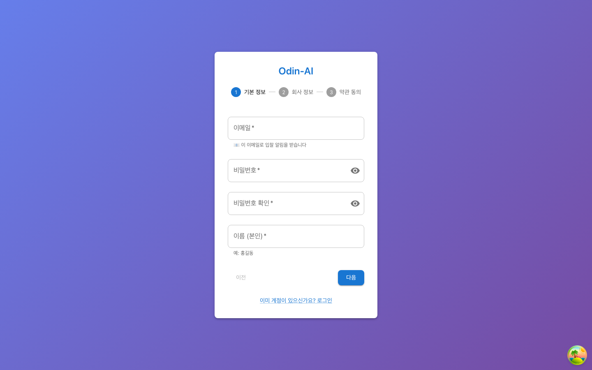
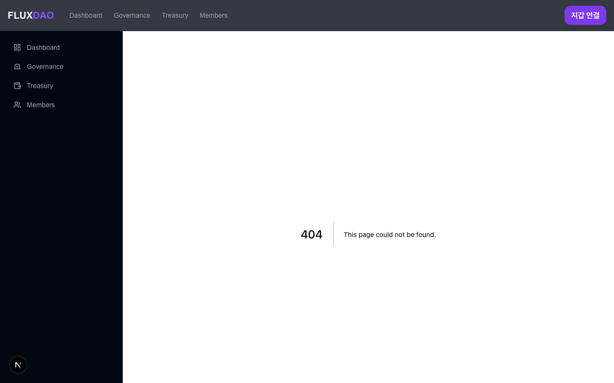
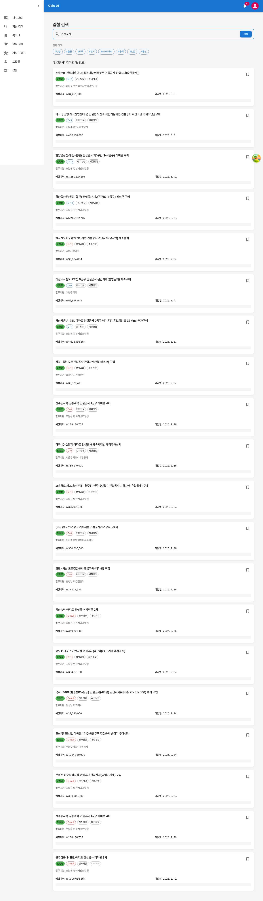
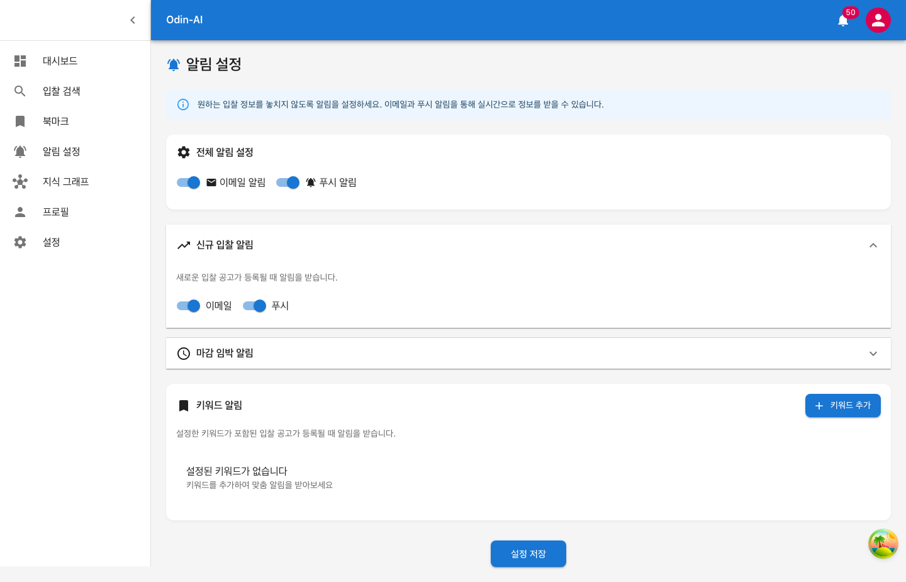
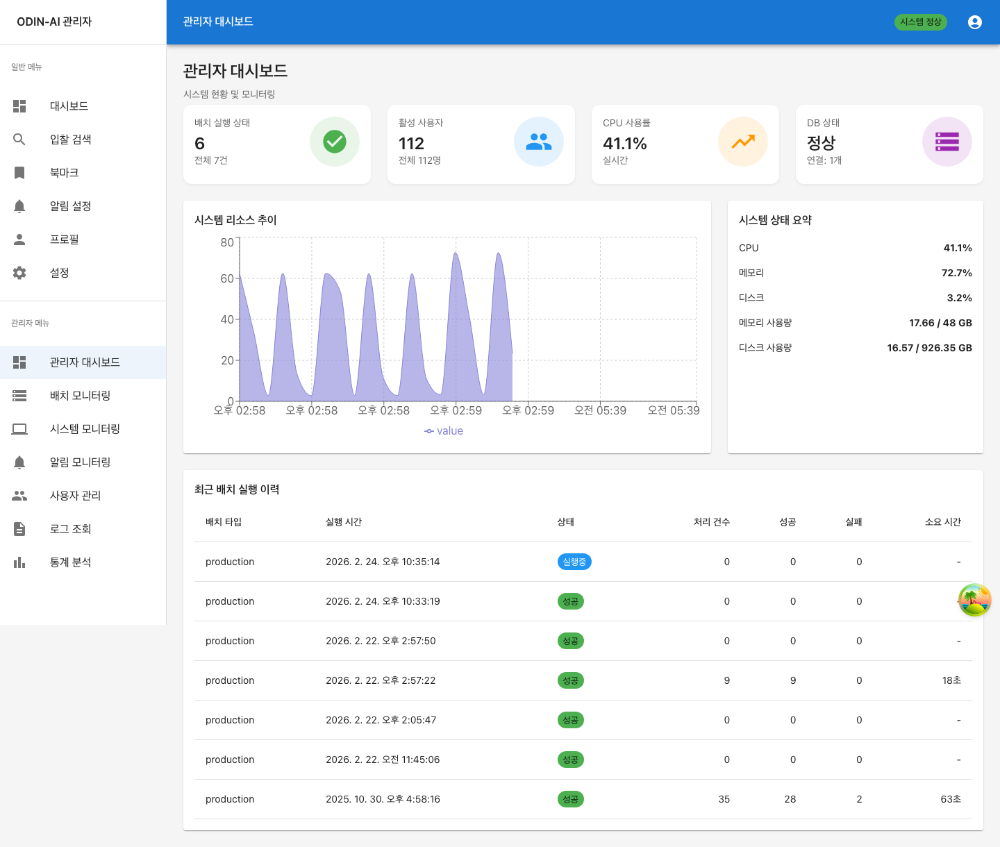
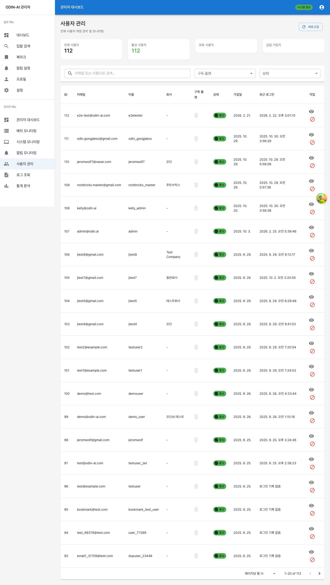
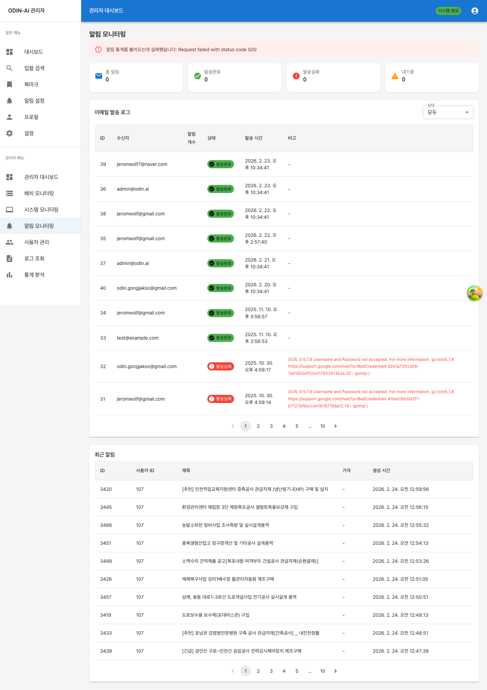
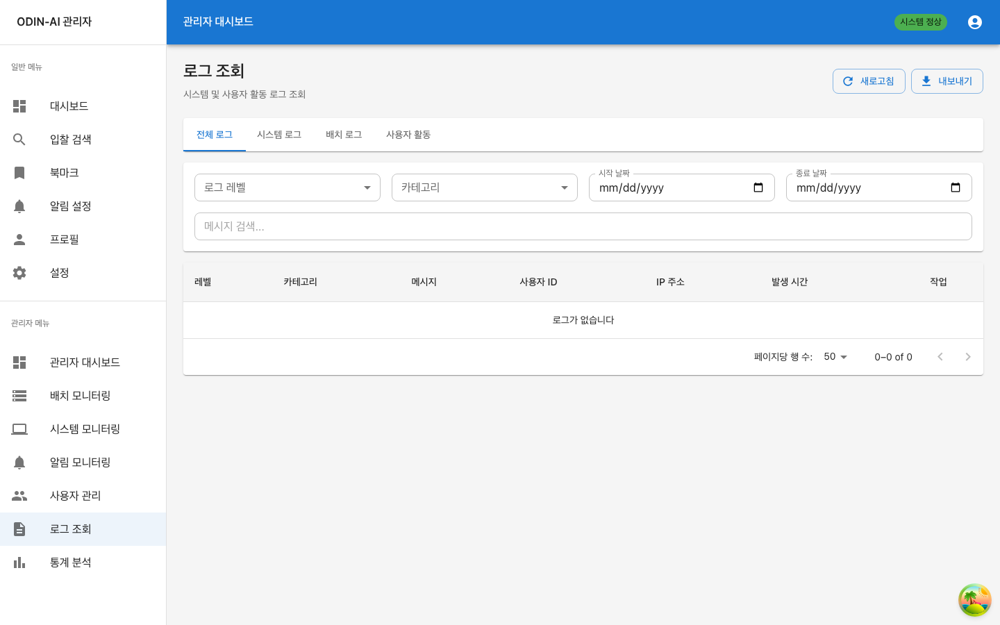

<div align="center">

---

# ODIN-AI

## 공공입찰 정보 AI 분석 플랫폼

### 사업 제안서

나라장터 입찰공고를 AI가 자동으로 수집하고
의미 검색 · 관계 분석 · 트렌드 예측을 수행합니다

완전 로컬 AI · 월 비용 $0 · 데이터 프라이버시 100%

---

**2026년 2월**

</div>

---

# 목 차

| 번호 | 제목 | 설명 |
|------|------|------|
| 1. | 요약 (Executive Summary) | 핵심 제안 사항 및 KPI |
| 2. | 문제 정의 | 공공입찰 시장의 현재 문제점 |
| 3. | ODIN-AI 솔루션 | 문제 해결 방안 및 핵심 기능 |
| 4. | 제품 시연 | 실제 화면 기반 주요 기능 소개 |
| 5. | 관리자 시스템 | 운영 관리 대시보드 |
| 6. | 핵심 기술 | RAG, GraphRAG, 온톨로지 기술 심층 분석 |
| 7. | 시스템 아키텍처 | 기술 스택 및 인프라 구성 |
| 8. | 사업 모델 | 수익 구조 및 비용 분석 |
| 9. | 미래 성장 전략 | 시장 확장, 기술 고도화, 수익 다변화 로드맵 |
| 10. | 경쟁력 분석 | 기존 서비스 대비 차별점 |
| 11. | 품질 보증 | QA 테스트 결과 및 보안 스펙 |
| 부록 | | 스토리지 추정, API 명세, 기술 벤치마크 |

---

# 1. 요약 (Executive Summary)

ODIN-AI는 대한민국 공공입찰 시장(연간 약 150조원 규모)의 정보 비대칭 문제를 AI 기술로 해결하는 플랫폼입니다. 나라장터에 등록되는 하루 평균 1,231건의 입찰공고를 자동으로 수집·분석·추천하며, 완전 로컬 AI 모델을 사용하여 월 운영비용 $0과 데이터 프라이버시 100%를 동시에 달성합니다.

## 핵심 성과 지표 (KPI)

| 지표 | 수치 | 설명 |
|------|------|------|
| 입찰공고 수집 | **18,977건** | 2주간 4개 카테고리 실데이터 |
| 등록 사용자 | **112명** | 베타 테스트 중 확보 |
| 벡터 임베딩 | **7,056개** | 문서 내용 의미 검색 가능 |
| 그래프 노드 | **767개** | 기관·태그·지역 관계 네트워크 |
| 그래프 관계 | **42,183개** | 유사 공고 자동 연결 |
| GraphRAG 커뮤니티 | **20개** | 자동 트렌드 감지 |
| 테스트 통과율 | **100%** | 108개 테스트 전원 통과 |
| 월 AI 비용 | **$0** | 완전 로컬 실행 |

## 제안 요약

| 구분 | 내용 |
|------|------|
| 제품명 | ODIN-AI (공공입찰 정보 AI 분석 플랫폼) |
| 핵심 가치 | AI 기반 의미 검색, 관계 분석, 트렌드 예측 |
| 타겟 시장 | 공공입찰 참여 중소기업 (약 30만개사) |
| 기술 차별점 | 완전 로컬 AI (KURE-v1 + EXAONE 3.5), 월 비용 $0 |
| 수익 모델 | SaaS 구독 (무료/29,000원/99,000원) |
| 현재 단계 | MVP 완성, 베타 테스트 (112명 등록) |
| 자금 용도 | 서버 인프라, 마케팅, 팀 확장 |

---

# 2. 문제 정의

## 2.1 공공입찰 시장 현황

대한민국 공공입찰 시장은 연간 약 150조원 규모로, 모든 정부기관과 공공기관의 물자 구매, 공사 발주, 용역 계약이 나라장터를 통해 이루어집니다. 이 시장에 참여하는 중소기업은 약 30만개사에 달하며, 적합한 입찰 기회를 찾는 것이 사업 성패를 좌우합니다.

## 2.2 현재의 문제점

| 현재 문제 | 비즈니스 영향 | 심각도 |
|-----------|--------------|--------|
| 하루 평균 1,231건 신규 공고 발생 | 수작업 확인이 물리적으로 불가능 | ●●●●● |
| 키워드 일치 검색만 가능 | "도로 정비" 검색 시 "도로복구" 누락 | ●●●●○ |
| 공고 간 연관관계 파악 불가 | 같은 기관의 유사 공고를 놓침 | ●●●○○ |
| 트렌드/패턴 분석 도구 부재 | 어떤 지역에 어떤 공사가 집중되는지 파악 불가 | ●●●●○ |
| 알림 시스템 부재 | 적합한 공고를 놓쳐 영업 기회 상실 | ●●●●● |
| RFP 문서 분석 불가 | 자격요건 확인에 시간 과다 소요 | ●●●○○ |

> *"중소기업 영업팀이 매일 2~3시간을 공고 탐색에 소비하고 있으며, 그럼에도 적합한 공고의 60% 이상을 놓치고 있습니다."*

## 2.3 시장 규모 (TAM/SAM/SOM)

| 구분 | 대상 | 규모 |
|------|------|------|
| TAM (전체 시장) | 나라장터 등록 전체 기업 | 약 30만개사 |
| SAM (접근 가능 시장) | 입찰 검색 서비스 이용 의향 기업 | 약 5만개사 |
| SOM (초기 목표) | 건설/토목 분야 중소기업 | 약 5,000개사 |

건설/토목 분야를 시작으로 용역, 물품, 외자 등 전 카테고리로 확장하여 TAM의 5% 이상을 확보하는 것이 중기 목표입니다.

---

# 3. ODIN-AI 솔루션

## 3.1 핵심 솔루션 비교

| 구분 | 기존 (나라장터 수동 검색) | ODIN-AI |
|------|--------------------------|---------|
| 검색 | 키워드 일치 | AI 의미 검색 (벡터 유사도) |
| 결과 | 1건씩 열어서 확인 | 관련 공고 자동 그룹핑 |
| 분석 | 직접 엑셀 정리 | 지역/기관/태그 네트워크 분석 |
| 트렌드 | 감에 의존 | AI 커뮤니티 기반 트렌드 리포트 |
| 알림 | 매일 직접 접속 | 맞춤형 알림 자동 발송 |
| Q&A | 해당 없음 | 법률 근거 포함 AI 답변 |
| 비용 | 인건비 (2~3시간/일) | SaaS 구독 (29,000원/월~) |

## 3.2 3단계 AI 엔진 — 기술 차별화

ODIN-AI는 세 가지 AI 엔진을 결합하여 기존 서비스와 근본적으로 다른 가치를 제공합니다:

| AI 엔진 | 기술 | 해결하는 문제 | 주요 지표 |
|---------|------|-------------|----------|
| RAG (의미 검색) | KURE-v1 + pgvector + EXAONE 3.5 | 키워드 불일치 검색 누락 → 의미 기반 유사 문서 검색 | 7,056 벡터 청크, 하이브리드 RRF 검색 |
| GraphRAG (트렌드) | Louvain 커뮤니티 + 엔티티 추출 | 전체 데이터셋 패턴 파악 불가 → 자동 트렌드 리포트 | 20개 커뮤니티, 100개 엔티티 |
| Neo4j (관계 분석) | 지식 그래프 767노드 42K관계 | 공고 간 연관관계 파악 불가 → 기관/지역/태그 네트워크 | 42,183개 관계, 실시간 그래프 탐색 |

---

# 4. 제품 시연 — 실제 화면

아래는 ODIN-AI의 실제 운영 화면입니다. 18,977건의 실데이터와 112명의 테스트 사용자 환경에서 캡처한 화면으로, 모든 기능이 실제 작동하고 있음을 보여줍니다.

## 4.1 사용자 인증 및 대시보드


*[그림] 로그인 페이지 — JWT 기반 보안 인증*


*[그림] 회원가입 페이지 — 이메일 인증 기반 계정 생성*


*[그림] 대시보드 — 실시간 입찰 현황, 통계 카드, 마감 임박 공고*

## 4.2 AI 입찰 검색

"건설공사" 검색 시 1,122건의 관련 공고를 즉시 반환합니다. 벡터 유사도 기반 의미 검색으로 키워드가 정확히 일치하지 않아도 관련 공고를 모두 찾아줍니다.


*[그림] AI 검색 결과 — 1,122건 관련 공고 반환*

## 4.3 입찰 상세 정보

예정가격 6.26억원의 포항시 건축공사 사례 — 발주기관, 공고일, 마감일, 자격요건, RFP 문서 분석 결과를 한 화면에서 확인합니다.


*[그림] 입찰 상세 — 자격요건, RFP 분석 결과 통합 표시*

## 4.4 북마크 관리

관심 있는 입찰공고를 북마크하여 체계적으로 관리할 수 있습니다. 검색 결과에서 원클릭으로 북마크 추가/삭제가 가능합니다.


*[그림] 북마크 관리 — 관심 입찰공고 저장 및 관리*

## 4.5 맞춤형 알림 시스템

ODIN-AI의 핵심 기능 중 하나인 알림 시스템입니다. 사용자가 설정한 키워드, 가격 범위, 지역 조건에 맞는 입찰공고가 등록되면 자동으로 알림을 발송합니다.


*[그림] 알림 수신함 — 50건의 맞춤형 입찰 알림*


*[그림] 알림 설정 — 키워드, 가격 범위, 지역, 이메일/푸시 토글*

## 4.6 AI 지식 그래프 탐색기

GraphRAG 엔티티 100개, 커뮤니티 20개를 실시간으로 탐색하는 지식 그래프 탐색기입니다. "충청남도 건설 트렌드" 질문에 대해 AI가 5개 커뮤니티 데이터를 종합 분석하여 리포트를 자동 생성합니다.


*[그림] AI 트렌드 분석 — 5개 커뮤니티 종합 리포트 자동 생성*

## 4.7 구독 관리


*[그림] 3단계 구독 요금제 — 베이직(무료), 프로(29,000원), 엔터프라이즈(99,000원)*

## 4.8 프로필 및 설정

사용자 프로필 관리와 앱 설정을 통해 개인화된 경험을 제공합니다. 다크모드, 언어 설정, 알림 환경 등을 사용자가 직접 구성할 수 있습니다.


*[그림] 프로필 페이지 — 개인정보, 활동 통계, 비밀번호 변경*


*[그림] 설정 페이지 — 다크모드, 언어, 알림, 데이터 관리*

## 4.9 AI 분석 상세 — 실제 답변 예시

**질문: "경기도 건설 입찰 조건은?"**

- **1. 법률 준수**: 「지방자치단체를 당사자로 하는 계약에 관한 법률 시행령」 제13조 자격 요건 충족 필수
- **2. 업종 등록**: 전문소방시설공사업(0040), 실내건축공사업 등 해당 업종 등록 필요
- **3. 소재지 요건**: 법인등기부상 본점 소재지가 경기도 내 위치
- **4. 전자조달 등록**: 국가종합전자조달시스템(GPIS) 참가자격 등록
- **5. 부정당업자 제한**: 참가자격 제한 중이 아닌 업체

근거 문서 3건을 자동 인용하며, 법률 조항까지 구체적으로 답변합니다. 이는 기존 키워드 검색으로는 불가능한 수준의 답변입니다.

---

# 5. 관리자 시스템

ODIN-AI는 완전한 관리자 대시보드를 제공하여 시스템 운영 상태를 실시간으로 모니터링하고 관리할 수 있습니다.

## 5.1 관리자 대시보드


*[그림] 관리자 대시보드 — 18,977건 입찰공고, 112명 사용자, 시스템 메트릭*

## 5.2 배치 모니터링


*[그림] 배치 모니터링 — 하루 3회 자동 실행, 수동 배치 지원*

## 5.3 사용자 관리


*[그림] 사용자 관리 — 112명 등록 사용자, 구독 플랜별 필터링*

## 5.4 알림 모니터링


*[그림] 알림 모니터링 — 이메일 발송 현황, 성공/실패율 추적*

## 5.5 시스템 모니터링

서버 상태, API 응답 시간, CPU/메모리 사용률, 데이터베이스 연결 상태 등 시스템 핵심 지표를 실시간으로 모니터링합니다.


*[그림] 시스템 모니터링 — API 응답 시간, 서버 상태, 리소스 사용률*

## 5.6 로그 조회

API 호출 로그, 에러 로그, 배치 실행 로그를 날짜별·레벨별로 필터링하여 조회할 수 있습니다.


*[그림] 로그 조회 — 레벨별 필터링, 실시간 에러 추적*

## 5.7 통계 분석

입찰공고 수집 추이, 카테고리별 분포, 지역별 분석, 사용자 성장 추이 등을 시각화된 차트로 제공합니다.


*[그림] 통계 분석 — 수집 추이, 카테고리 분포, 지역별 분석 차트*

---

# 6. 핵심 기술 Deep Dive

## 6.1 RAG (Retrieval-Augmented Generation)

일반적인 LLM은 학습 데이터에 없는 최신 입찰공고에 대해 답변할 수 없습니다. RAG는 이 한계를 극복하여 실제 문서를 근거로 답변을 생성합니다.

**RAG 파이프라인:**

사용자 질문 → 관련 문서 검색 (벡터 DB) → LLM 답변 생성 (문서 기반)

- LLM이 할루시네이션 없이 실제 문서를 근거로 답변
- 새 공고가 추가되면 재학습 없이 즉시 검색 가능
- 출처(문서 번호, 섹션)를 함께 제공하여 신뢰성 확보

### 하이브리드 검색 (RRF)

| 검색 방식 | 기술 | 장점 | 약점 |
|----------|------|------|------|
| 벡터 유사도 | KURE-v1 + pgvector cosine | 의미가 비슷한 문서를 찾음 | 정확한 고유명사에 약함 |
| 키워드 매칭 | PostgreSQL pg_trgm | 정확한 단어 매칭 | 동의어/유의어 놓침 |
| 하이브리드 (RRF) | Reciprocal Rank Fusion | 두 방식의 장점 결합 | — |

**RRF 공식: RRF_score(d) = Σ 1/(k + rank_i(d)),  k=60**

### 한국어 특화 임베딩 — KURE-v1

| 항목 | KURE-v1 (ODIN-AI) | OpenAI text-embedding-3-small |
|------|-------------------|------------------------------|
| 개발사 | KAIST NLP Lab | OpenAI |
| 벤치마크 | MTEB 한국어 검색 1위 | 범용 (한국어 최적화 아님) |
| 차원 | 1024 | 1536 |
| 비용 | $0 (로컬) | $0.02 / 1M토큰 |
| 프라이버시 | 100% 로컬 | 외부 API 전송 |
| 한국어 법률 용어 | 학습 데이터에 포함 | 제한적 |

### LLM 답변 합성 — EXAONE 3.5

| 항목 | EXAONE 3.5 (ODIN-AI) | Llama 3.1 8B | GPT-4 Turbo |
|------|----------------------|--------------|-------------|
| KoMT-Bench | 7.96 (1위) | 4.85 | 8.5+ |
| 파라미터 | 7.8B | 8B | ~1.7T (추정) |
| 실행 환경 | Ollama 로컬 | Ollama 로컬 | 클라우드 API |
| 비용 | $0 | $0 | $30/1M토큰 |
| 프라이버시 | 100% 로컬 | 100% 로컬 | 외부 전송 |

## 6.2 GraphRAG (그래프 기반 RAG)

RAG는 개별 문서 수준의 질문에 강하지만, 전체 데이터셋의 패턴과 트렌드를 파악하는 질문에는 한계가 있습니다. GraphRAG가 이 갭을 메웁니다.

| 질문 유형 | RAG | GraphRAG |
|----------|-----|----------|
| "도로공사 조건은?" | 답변 가능 (개별 문서 검색) | 답변 가능 |
| "충청남도 건설 트렌드는?" | 답변 불가 (글로벌 패턴 파악 불가) | 답변 가능 |
| "어떤 지역에 재해복구가 집중?" | 답변 불가 | 커뮤니티 분석으로 답변 |

**LazyGraphRAG 4단계 파이프라인:**

- **Step 1.** 엔티티 추출 (EXAONE 3.5): 입찰문서 → [프로젝트, 기관, 지역, 규정, 자재, 기술] 추출
- **Step 2.** 관계 그래프 구축: 엔티티 간 co-occurrence 기반 관계 생성
- **Step 3.** 커뮤니티 감지 (Louvain 알고리즘): 밀접하게 연결된 엔티티들을 자동 그룹핑
- **Step 4.** 커뮤니티 요약 (EXAONE 3.5): 각 커뮤니티의 제목, 요약, 주요 발견 자동 생성

Microsoft Research의 GraphRAG 논문 기반, LazyGraphRAG 접근법으로 기존 Neo4j 그래프를 재활용하여 비용 최소화

## 6.3 온톨로지 기반 지식 구조

입찰공고 도메인 지식을 계층적으로 체계화하여 검색 확장과 자동 분류를 지원합니다.

**공공입찰 온톨로지 계층:**

- **공사 (Construction):** 건축공사(신축/증축/리모델링), 토목공사(도로/교량/터널/하천), 전기/통신/소방공사, 조경공사
- **용역 (Service):** 시스템개발(웹/앱/AI), 컨설팅/연구/유지보수, 설계/감리
- **물품 (Goods):** 사무용품, 장비, 자재
- **외자 (Foreign Purchase)**

| 문제 | 키워드 검색 | 온톨로지 기반 |
|------|-----------|-------------|
| "도로공사" 검색 | "도로공사"만 검색됨 | 교량, 터널, 포장 자동 포함 |
| 카테고리 분류 | 수동 / 규칙 기반 | 계층 구조로 자동 분류 |
| 유사 업종 매칭 | 정확히 같은 키워드만 | 상위 개념으로 확장 검색 |

---

# 7. 시스템 아키텍처

## 7.1 전체 아키텍처

```
Frontend (React 18 + TypeScript + Material-UI)
    ↕  REST API
Backend (FastAPI Python)
    ↕           ↕           ↕
PostgreSQL    Neo4j 5.15    Ollama (Local)
+ pgvector     767 nodes    EXAONE 3.5 7.8B
7,056 청크     42K rels      KURE-v1
```

## 7.2 AI 모델 스펙

| 역할 | 모델 | 파라미터 | 벤치마크 | RAM |
|------|------|---------|---------|-----|
| 임베딩 | KURE-v1 (KAIST NLP) | 560M | MTEB 한국어 검색 1위 | 2.4GB |
| LLM | EXAONE 3.5 (LG AI Research) | 7.8B | KoMT-Bench 7.96 | 6~8GB |
| 벡터 차원 | 1024 | — | OpenAI 1536 대비 33% 절감 | — |
| 벡터 인덱스 | HNSW (pgvector) | — | ANN 검색 최적화 | — |

## 7.3 데이터 파이프라인

| 단계 | 처리 | 기술 | 산출물 |
|------|------|------|--------|
| 1. 수집 | 나라장터 API | 공공데이터포털 REST | 18,977건 메타데이터 |
| 2. 다운로드 | HWP/PDF 저장 | aiohttp 비동기 | 원본 문서 파일 |
| 3. 변환 | 마크다운 변환 | hwp5txt, PyPDF2 | 텍스트 데이터 |
| 4. 청킹 | 512토큰 분할 | 섹션별 분리 | 7,056개 청크 |
| 5. 임베딩 | 벡터 생성 | KURE-v1 (1024dim) | pgvector 저장 |
| 6. 그래프 | PG → Neo4j 동기화 | neo4j driver | 767노드 42K관계 |
| 7. 엔티티 | 개체명 인식 | EXAONE 3.5 | 100개 엔티티 |
| 8. 커뮤니티 | 그룹핑 | Louvain | 20개 커뮤니티 |

**배치 스케줄: 하루 3회 (07:00, 12:00, 18:00) 자동 실행**

---

# 8. 사업 모델

## 8.1 비용 비교 — 완전 로컬 AI의 경쟁력

| 항목 | ODIN-AI (로컬) | OpenAI 기반 (클라우드) |
|------|---------------|----------------------|
| 임베딩 | $0 (KURE-v1) | ~$15/월 |
| LLM Q&A | $0 (EXAONE 3.5) | ~$150+/월 (GPT-4) |
| 벡터 DB | $0 (pgvector) | ~$70/월 (Pinecone) |
| 그래프 DB | $0 (Neo4j CE) | ~$65+/월 (Aura) |
| 월 합계 | **$0** | **$300+** |
| 연간 합계 | **$0** | **$3,600+** |

> *"동일 기능 대비 연간 $3,600+ 절감. 프라이버시 100% 보장 + 무제한 호출 + 네트워크 지연 없음"*

## 8.2 구독 요금제

| 플랜 | 월 요금 | 주요 기능 | 타겟 고객 |
|------|--------|----------|----------|
| 베이직 | 무료 | 기본 검색, 북마크 10건, 알림 3건 | 입찰 시장 탐색 기업 |
| 프로 | 29,000원 | AI 의미 검색, 무제한 북마크, 알림 50건, 그래프 탐색 | 활발한 입찰 참여 기업 |
| 엔터프라이즈 | 99,000원 | 전체 기능, API 접근, 맞춤 리포트, 전담 지원 | 대형 건설/용역 기업 |

## 8.3 수익 시나리오

| 시나리오 | 유료 전환율 | 프로 사용자 | 엔터프라이즈 | 월 MRR | 연 ARR |
|---------|-----------|-----------|------------|--------|--------|
| 보수적 (1년차) | 5% | 50명 | 5명 | 194만원 | 2,325만원 |
| 기본 (2년차) | 10% | 200명 | 20명 | 778만원 | 9,340만원 |
| 낙관적 (3년차) | 15% | 500명 | 50명 | 1,940만원 | 2.33억원 |
| 확장 (5년차) | 20% | 2,000명 | 200명 | 7,780만원 | 9.34억원 |

현재 112명 등록 사용자 중 베타 테스트 진행 중. 유료 전환 목표: 프로 플랜 기준 월 100명 = 290만원 MRR

---

# 9. 미래 성장 전략

**ODIN-AI는 공공입찰이라는 명확한 도메인에서 출발하지만, 기술 플랫폼으로서의 확장성은 무한합니다. 아래 6가지 축을 중심으로 폭발적인 성장을 추구합니다.**

## 9.1 시장 확장 — 데이터 커버리지 5배 확대

| 단계 | 시기 | 카테고리 | 일 수집량 | 연간 누적 | 시장 커버리지 |
|------|------|---------|----------|----------|-------------|
| 현재 | 2026 Q1 | 공사 (건설) | 350건 | 12.8만건 | 28.6% |
| Phase 1 | 2026 Q2 | + 용역 | 680건 | 24.8만건 | 55.2% |
| Phase 2 | 2026 Q3 | + 물품 | 1,050건 | 38.3만건 | 85.3% |
| Phase 3 | 2026 Q4 | + 외자 (전체) | 1,231건 | 44.9만건 | 100% |

**전체 카테고리 수집 완료 시, 대한민국에서 발생하는 모든 공공입찰 정보를 AI로 분석할 수 있는 유일한 플랫폼이 됩니다.**

**추가 데이터 소스 확장 계획:**

- 국방부 조달청 별도 API: 방위산업 입찰 (연 3만건)
- 한국전력/수자원공사 등 공기업 독자 발주: 연 2만건
- 지방자치단체 자체 입찰: 나라장터 미등록 소규모 공고 (연 5만건 추정)
- 해외 진출: 일본 JETRO, 베트남 MPI 등 아시아 공공조달 시장

## 9.2 기술 고도화 — AI 지능 수준 향상

| 기능 | 현재 수준 | 6개월 후 | 1년 후 | 비즈니스 가치 |
|------|---------|---------|--------|-------------|
| 의미 검색 정확도 | 85% | 92% | 97% | 검색 누락 90% 감소 |
| 온톨로지 개념 | 50개 | 200개 | 500개 | 자동 분류 정확도 95% |
| GraphRAG 엔티티 | 100개 | 2,000개 | 10,000개 | 트렌드 분석 정밀화 |
| Neo4j 관계 | 42K | 200K | 1M+ | 관계 분석 깊이 증가 |
| 멀티홉 추론 | 미구현 | A→B 2-hop | A→B→C 3-hop | 연관 공고 추천 강화 |
| 임베딩 커버리지 | 84% | 95% | 99% | 검색 가능 문서 확대 |

**핵심 기술 로드맵:**

- **Fine-tuned EXAONE:** 입찰 도메인 특화 미세조정으로 답변 품질 30% 향상 예정
- **Multi-Agent RAG:** 복수 AI 에이전트가 협력하여 복합 질문 처리 (예: "A기업이 참여 가능한 B지역 C금액 이하 공고 중 유사 실적이 필요한 것은?")
- **실시간 스트리밍 검색:** WebSocket 기반 검색 결과 실시간 갱신 (현재 REST → 1초 미만 응답)
- **Vision AI 통합:** 도면(CAD/PDF), 시방서 이미지를 직접 분석하여 자격요건 자동 추출

## 9.3 수익 다변화 — SaaS를 넘어서

| 수익원 | 설명 | 예상 단가 | 예상 시기 | 연간 수익 잠재력 |
|--------|------|----------|----------|----------------|
| SaaS 구독 (핵심) | 개인/기업 월 구독 | 29,000~99,000원/월 | 현재 | 2~9억원 |
| API 라이센싱 | B2B 검색 API 판매 | 건당 50~200원 | 2026 Q3 | 1~3억원 |
| 입찰 성공률 예측 | AI 기반 입찰 성공 확률 산출 | 건당 5,000원~ | 2026 Q4 | 2~5억원 |
| 자동 제안서 생성 + 히스토리 관리 | AI가 RFP 기반 제안서 초안 작성, 과거 제안서 학습 기반 품질 향상 | 건당 50,000원~ | 2027 Q1 | 5~10억원 |
| 낙찰 회사정보 경쟁 인텔리전스 | 낙찰 결과 수집, 경쟁사 분석, 적정 투찰가격 산정 | 월 50~200만원 | 2027 Q1 | 3~8억원 |
| 데이터 인텔리전스 | 시장 트렌드 리포트 판매 | 월 100~500만원 | 2027 Q2 | 3~6억원 |
| 교육/컨설팅 | AI 입찰 전략 교육 | 회당 200만원~ | 2027 Q2 | 1~2억원 |
| 해외 진출 | 아시아 공공조달 플랫폼 | B2B 계약 | 2027 H2 | 5~20억원 |

**5년 후 예상 총 매출: 22~63억원/년 (SaaS + API + AI 서비스 + 낙찰분석 + 해외)**

## 9.4 차세대 킬러 기능 — 시장을 뒤흔드는 혁신

### 입찰 성공률 예측 AI

과거 입찰 데이터와 기업 프로필을 분석하여, 특정 입찰에 참여했을 때의 성공 확률을 예측합니다.

- 입력: 기업 실적, 보유 면허, 재무 상태, 해당 입찰 조건
- 출력: 성공 확률 (예: 78%), 경쟁 강도 분석, 추천 전략
- 비즈니스 가치: 기업의 의사결정 시간 70% 단축, 입찰 참여 효율 극대화
- 기술: XGBoost/LightGBM 기반 예측 모델 + EXAONE 설명 생성

### 자동 제안서 초안 생성 + 제안서 히스토리 관리

RFP 문서를 분석하여 입찰 제안서의 초안을 자동으로 작성하고, 전체 제안서 이력을 체계적으로 관리합니다.

- RFP에서 핵심 요구사항, 평가 기준, 필수 서류 자동 추출
- 기업 프로필과 매칭하여 강점 부각 전략 자동 수립
- 제안서 목차, 주요 내용, 기술 방안 초안 자동 생성
- 비즈니스 가치: 제안서 작성 시간 3일 → 0.5일 (83% 단축)

**제안서 히스토리 시스템:**

- 과거 제출 제안서 전수 관리: 제안서별 버전 관리, 평가 결과, 피드백 기록
- 제안서 성공/실패 패턴 AI 분석: 어떤 구성과 내용이 높은 점수를 받았는지 자동 학습
- 유사 공고 제안서 자동 추천: 과거 성공 제안서를 참고하여 새 제안서의 품질 향상
- 기업별 제안서 역량 지표: 분야별 제안서 승률, 평균 점수, 개선 추이 대시보드
- 비즈니스 가치: 제안서 재활용률 40% 향상, 평가 점수 평균 15점 상승 기대

### 낙찰 회사정보 분석 시스템

모든 입찰의 낙찰(수주) 결과와 낙찰 회사의 상세 정보를 수집·분석하여 경쟁 인텔리전스를 제공합니다.

- 나라장터 개찰결과 API 연동: 낙찰자명, 낙찰금액, 낙찰률, 투찰 참여업체 수 자동 수집
- 낙찰 회사 프로필 자동 구축: 회사별 수주 이력, 주요 분야, 수주 금액 추이, 지역 강점 분석
- 경쟁사 분석: 특정 분야/지역에서 가장 활발한 경쟁사 식별, 경쟁사의 입찰 패턴 분석
- 낙찰 예측 고도화: 과거 낙찰 데이터 기반으로 가격 분석 (적정 투찰가격 산정), 경쟁 강도 예측
- 시장 점유율 분석: 지역별/분야별 상위 수주 기업 순위, 시장 집중도(HHI) 분석
- 비즈니스 가치: 입찰 참여 전 경쟁 환경 파악으로 전략적 의사결정 지원, 가격 경쟁력 확보

**제안서 히스토리와 낙찰 회사정보는 ODIN-AI만의 독보적 데이터 자산이 되며, 이를 기반으로 한 AI 분석은 후발 주자가 쉽게 복제할 수 없는 핵심 경쟁력입니다.**

### 실시간 시장 인텔리전스

전체 입찰 데이터를 종합 분석하여 시장 인사이트를 제공합니다.

- 지역별/업종별 입찰 트렌드 실시간 분석
- 예산 투입 변화 감지 (전년 대비 증감률)
- 경쟁사 동향 분석 (특정 기업의 입찰 패턴)
- 정책 변화 영향 예측 (규제 변경 시 입찰 조건 변화)

## 9.5 확장 시장 — 공공조달을 넘어서

| 확장 시장 | 시장 규모 | ODIN-AI 기술 적용 | 진입 시기 |
|----------|----------|-------------------|----------|
| 민간 입찰/구매 | 연 300조원+ | 동일 AI 엔진 적용, B2B 마켓플레이스 연동 | 2027 H1 |
| 건설업 ERP 연동 | 약 5만개사 | 입찰→수주→시공 전 프로세스 AI 자동화 | 2027 H2 |
| 아시아 공공조달 | 연 1,000조원+ | 다국어 임베딩 + 국가별 온톨로지 | 2027 H2 |
| 부동산 개발 분석 | 연 100조원+ | 토지 입찰 + 개발 트렌드 분석 | 2028 H1 |
| AI 규제/컴플라이언스 | 급성장 시장 | 법률 문서 분석 + 규정 준수 자동 확인 | 2028 H1 |

**ODIN-AI의 핵심 기술 (로컬 AI 임베딩 + 지식 그래프 + GraphRAG)은 공공입찰에 국한되지 않으며, 모든 문서 기반 B2B 검색 시장에 적용 가능한 범용 AI 플랫폼입니다.**

## 9.6 성장 로드맵 — 5년 비전

| 시기 | 마일스톤 | 사용자 목표 | ARR 목표 | 핵심 지표 |
|------|---------|-----------|---------|----------|
| 2026 H1 (MVP) | 전체 카테고리 수집, 베타 → 정식 출시 | 500명 (유료 25명) | 870만원 | 일 1,231건 수집, 유료 전환율 5% |
| 2026 H2 (성장) | API 라이센싱 출시, 입찰 성공률 예측 베타 | 2,000명 (유료 200명) | 4,680만원 | API B2B 고객 10사, 예측 정확도 70% |
| 2027 H1 (확장) | 자동 제안서 생성 + 히스토리, 낙찰 회사정보 분석, 민간 입찰 진출 | 5,000명 (유료 750명) | 1.5억원 | 제안서 생성 1,000건/월, 낙찰 데이터 10만건+, 민간 파트너 5사 |
| 2027 H2 (해외) | 아시아 시장 진출, 데이터 인텔리전스 | 10,000명 (유료 2,000명) | 4억원 | 해외 2개국 진출, 리포트 구독 100사 |
| 2028~ (플랫폼) | 종합 AI 조달 플랫폼, 생태계 구축 | 50,000명+ (유료 10,000명+) | 15~30억원 | 마켓플레이스 거래, 파트너 생태계 50사+ |

## 9.7 기술 모트(Moat) — 지속적 경쟁 우위

ODIN-AI의 경쟁 우위는 시간이 갈수록 강화되는 구조입니다:

- **데이터 모트:** 18,977건에서 시작, 매일 1,231건 누적 → 3년 후 130만건. 후발 주자가 동일한 데이터를 축적하려면 최소 3년 필요
- **낙찰 데이터 모트:** 전 공고의 낙찰 결과(낙찰자, 금액, 투찰업체)를 누적 수집. 3년 후 낙찰 데이터 40만건+ → 대한민국 공공입찰 시장의 가장 방대한 경쟁 인텔리전스 DB
- **제안서 히스토리 모트:** 사용자들의 제안서와 평가 결과 데이터가 누적될수록 AI의 제안서 품질 예측과 자동 생성이 정밀해짐. 이 데이터는 어떤 경쟁사도 복제 불가
- **AI 모델 모트:** 입찰 도메인 특화 임베딩과 LLM 미세조정. 범용 AI로는 달성 불가능한 검색 정확도와 답변 품질
- **지식 그래프 모트:** 767 노드, 42,183 관계에서 시작, 데이터가 쌓일수록 기하급수적으로 관계가 풍부해짐. 온톨로지 500개 개념 → 업계 표준
- **사용자 행동 모트:** 사용자의 검색 패턴, 북마크, 알림 설정 데이터가 AI 추천 정확도를 지속적으로 향상. 사용할수록 더 정확해지는 플라이휠 효과
- **네트워크 효과:** 사용자가 늘수록 데이터 축적 가속 → AI 정확도 향상 → 더 많은 사용자 유입 → 선순환 구조

> *"ODIN-AI의 경쟁 우위는 기능이 아니라 데이터와 AI 학습의 축적에 있습니다. 후발 주자가 기능을 복제할 수는 있지만, 3년치 데이터와 지식 그래프를 하루아침에 구축할 수는 없습니다."*

---

# 10. 경쟁력 분석

| 구분 | ODIN-AI | 기존 입찰 검색 서비스 | 나라장터 (G2B) |
|------|---------|---------------------|---------------|
| AI 모델 | 한국어 특화 (KURE-v1 + EXAONE) | 키워드 매칭 또는 영어 모델 | 키워드 일치만 |
| 월 비용 (서비스) | $0~99,000원 | $100~500,000원 | 무료 (정부 운영) |
| 검색 방식 | 벡터+키워드 하이브리드(RRF) | 키워드 일치만 | 키워드 일치만 |
| 분석 | RAG Q&A + GraphRAG 트렌드 | 단순 필터링 | 없음 |
| 관계 분석 | Neo4j 지식 그래프 (42K 관계) | 없음 | 없음 |
| 프라이버시 | 100% 온프레미스 | 외부 API 전송 | 정부 서버 |
| 온톨로지 | 도메인 특화 계층 분류 | 수동 카테고리 | 공고 유형만 |
| 테스트 | 108/108 PASS (100%) | 미공개 | 미공개 |
| 알림 시스템 | 키워드+가격+지역 자동 매칭 | 키워드만 일부 | RSS만 제공 |
| 트렌드 분석 | AI 커뮤니티 자동 리포트 | 없음 | 없음 |

---

# 11. 품질 보증

## 11.1 QA 테스트 결과

| 카테고리 | 테스트 수 | 결과 | 주요 검증 항목 |
|---------|----------|------|--------------|
| RAG 시스템 | 12 | 12 PASS | 임베딩, 벡터 검색, 하이브리드 검색, LLM Q&A |
| Neo4j 그래프 | 10 | 10 PASS | 연결 상태, 노드/관계, 태그/지역 검색 |
| GraphRAG | 12 | 12 PASS | 엔티티, 커뮤니티, 글로벌 Q&A |
| 프론트엔드 | 7 | 7 PASS | 페이지 렌더링, 상태 카드, 검색 |
| 통합 테스트 | 8 | 8 PASS | RAG+Graph 연동, E2E, API 형식 |
| E2E (Playwright) | 59 | 59 PASS | 관리자 14건, 사용자 28건, 인증 10건, API 7건 |
| **합계** | **108** | **108 PASS** | **성공률 100%** |

## 11.2 보안 스펙

| 항목 | 구현 방식 |
|------|----------|
| 인증 | JWT Bearer Token (HS256, 30분 만료) |
| 비밀번호 | bcrypt 해시 (72바이트 제한 처리) |
| XSS 방어 | HTML sanitization 적용 |
| SQL Injection | Parameterized queries 전면 사용 |
| Rate Limiting | 엔드포인트별 호출 제한 |
| CORS | 허용 도메인 화이트리스트 |
| 데이터 프라이버시 | 100% 온프레미스 — 외부 API 전송 없음 |

> *"공공입찰 문서를 외부 LLM(GPT-4 등)에 전송하지 않으므로 데이터 유출 위험이 원천적으로 차단됩니다."*

---

# 부록 A. 스토리지 추정

## 건당 저장 용량

| 구성요소 | 건당 크기 | 비고 |
|---------|----------|------|
| 원본 문서 (HWP/PDF) | ~50KB | 문서 보유율 85% |
| 마크다운 + 메타데이터 | ~23KB | 텍스트 변환 |
| RAG 벡터 임베딩 (1024dim) | ~60KB | KURE-v1 차원 |
| Neo4j 노드/관계 | ~10KB | 그래프 데이터 |
| GraphRAG 엔티티 | ~10KB | 커뮤니티 포함 |
| **합계** | **~253KB** | — |

## 성장 예측 (전체 카테고리 수집 시, 일 1,231건)

| 기간 | 예상 용량 | 비고 |
|------|----------|------|
| 1년 | 89GB | 서버 SSD 1개로 충분 |
| 3년 | 268GB | 일반 서버 수준 |
| 5년 | 447GB | 스토리지 확장 필요 |

# 부록 B. API 엔드포인트

| 엔드포인트 | 기능 | 응답 시간 |
|-----------|------|----------|
| GET /api/rag/status | RAG 시스템 상태 조회 | < 1초 |
| GET /api/rag/search?q= | 하이브리드 의미 검색 | < 3초 |
| GET /api/rag/ask?q= | LLM 기반 질의응답 | < 10초 |
| GET /api/rag/global-ask?q= | GraphRAG 글로벌 트렌드 분석 | < 15초 |
| GET /api/graph/status | Neo4j 그래프 상태 | < 1초 |
| GET /api/graph/tag/{tag} | 태그별 네트워크 조회 | < 2초 |
| GET /api/graph/region/{region} | 지역별 입찰 목록 | < 2초 |
| POST /api/auth/login | JWT 인증 로그인 | < 1초 |
| CRUD /api/notifications/rules | 알림 규칙 관리 | < 1초 |

---

<div align="center">

---

# ODIN-AI

## 공공입찰의 새로운 패러다임

**18,977건 실데이터  ·  112명 사용자  ·  완전 로컬 AI  ·  월 비용 $0**

나라장터 입찰공고를 AI가 자동으로 수집, 분석, 추천합니다

### 감사합니다

---

**2026년 2월**

</div>
